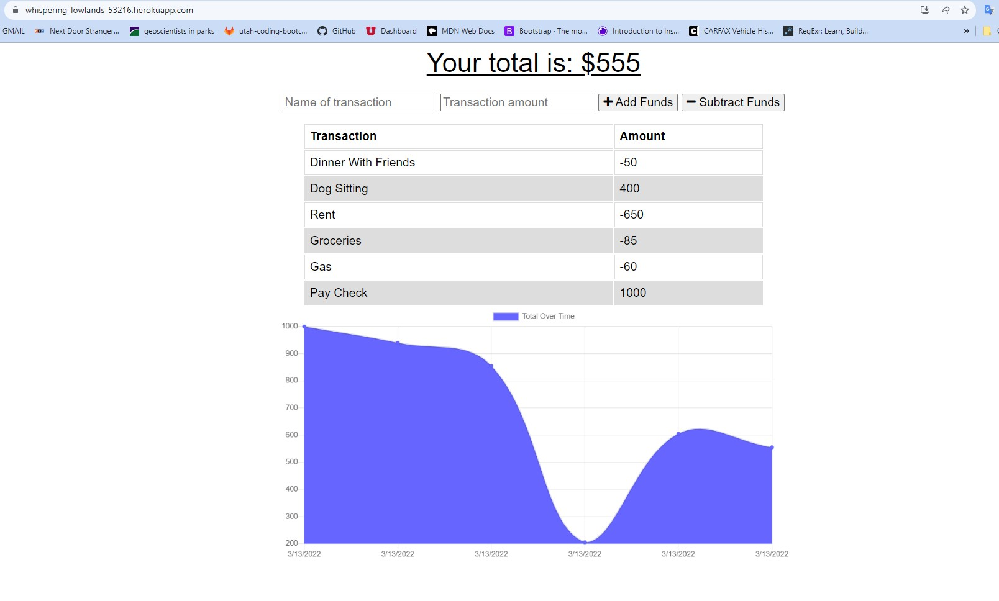
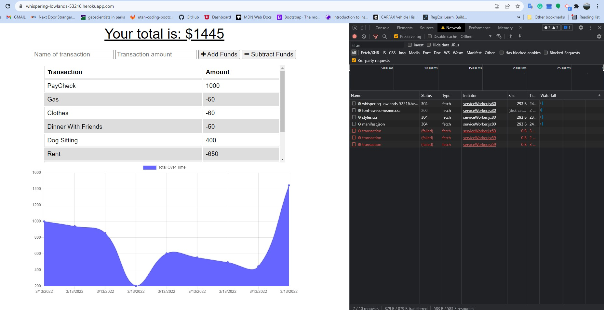
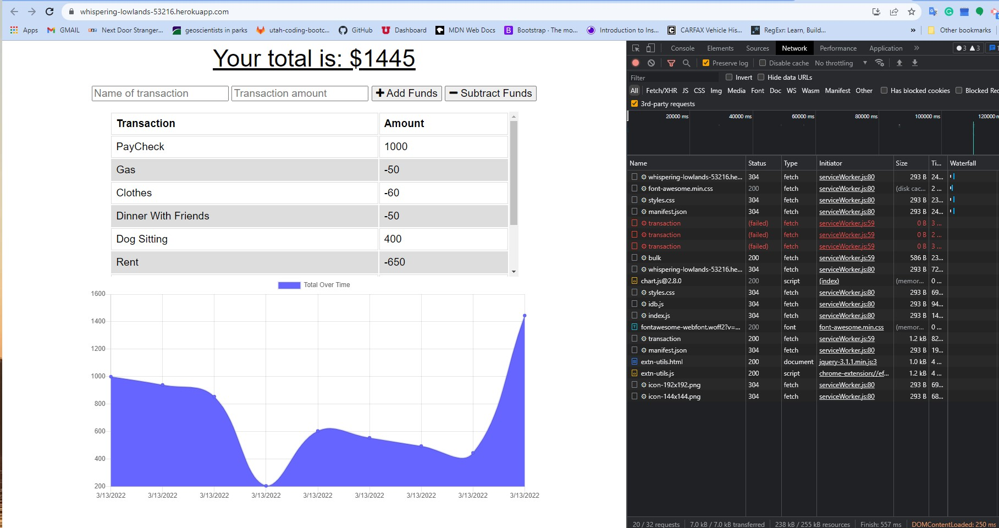

# my-finance-tracker

# Budget Tracker with MongoDb, IndexDb, Express, and Node

Link to Repo: [GITHUB-REPO](https://github.com/mhowitz/my-finance-tracker)

Heroku Link: [HEROKU](https://whispering-lowlands-53216.herokuapp.com)

## Description

The goal of this project was to create a budget tracker that can be accessible offline using a PWA. It was created using service workers, indexDb, Mongo, Express, and Node. 

## Table of Contents

* [Installation](#installation)
* [Usage](#usage)
* [License](#license)
* [Contributing](#contributing)
* [Questions](#questions)

## Installation

Clone the GitHub repo to the user's computer. Run "npm i" in the terminal to install all of the necessary packages. Then, the user can start the server using "npm start" or visit the live link on Heroku [here](https://whispering-lowlands-53216.herokuapp.com). Next, the user can navigate to their localhost:3001, or this link to begin tracking their budget online or offline.

## Usage

Once the application is open, the user can submit transactions that add or subtract funds from their budget.  

Here is a screenshot of what the application looks like in the browser:

Here is a screenshot of what the application looks like once the user has added transactions offline:

Once the user is back online, the transactions they added will stay there: 

## License 

[MIT License Link]https://choosealicense.com/licenses/mit/

MIT License

Copyright (c) 2022 Mikayla Howitz

Permission is hereby granted, free of charge, to any person obtaining a copy of this software and associated documentation files (the "Software"), to deal in the Software without restriction, including without limitation the rights to use, copy, modify, merge, publish, distribute, sublicense, and/or sell copies of the Software, and to permit persons to whom the Software is furnished to do so, subject to the following conditions:

The above copyright notice and this permission notice shall be included in all copies or substantial portions of the Software.

THE SOFTWARE IS PROVIDED "AS IS", WITHOUT WARRANTY OF ANY KIND, EXPRESS OR IMPLIED, INCLUDING BUT NOT LIMITED TO THE WARRANTIES OF MERCHANTABILITY, FITNESS FOR A PARTICULAR PURPOSE AND NONINFRINGEMENT. IN NO EVENT SHALL THE AUTHORS OR COPYRIGHT HOLDERS BE LIABLE FOR ANY CLAIM, DAMAGES OR OTHER LIABILITY, WHETHER IN AN ACTION OF CONTRACT, TORT OR OTHERWISE, ARISING FROM, OUT OF OR IN CONNECTION WITH THE SOFTWARE OR THE USE OR OTHER DEALINGS IN THE SOFTWARE.

## Contributing

## Questions

Click [here](https://github.com/mhowitz) to visit my GitHub profile

Email for questions: miikaylahowitz@gmail.com